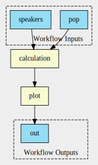

# Workflow Creation
Workflows are a key part of SciWIn as they are even part of the name (Scientific Workflow Infrastructure). SciWin Client facilitates the creation of CWL workflows from exisiting CWL CommandLineTools. Workflows in `s4n` are created piece by piece using a command for each edge of the directed acyclic graph (DAG) that represents the workflow.


/// caption
Simple Workflow 
///

## Creating a blank workflow
A blank workflow file can be created by using the `s4n workflow create` command.
=== ":octicons-terminal-16: Command"
    ```
    s4n workflow create my-workflow
    ```
=== ":simple-commonworkflowlanguage: my-workflow.cwl"
    ```yaml
    #!/usr/bin/env cwl-runner
    
    cwlVersion: v1.2
    class: Workflow
    
    inputs: []
    outputs: []
    steps: []
    ```

## Creating connections
Connections can be seen as the arrows in the above figure. Think about a sentence like 
> The arrow points from the input slot called `speakers` to the calculation steps input.

Therefore the command that created this arrow was `s4n workflow connect my-workflow --from @inputs/speakers --to calculation/speakers`.

!!! info
    more examples will follow..

