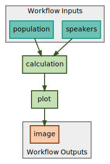
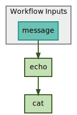

--- 
title: Workflow creation
---

Workflows are a key part of SciWIn as they are even part of the name (Scientific Workflow Infrastructure). SciWin Client facilitates the creation of CWL workflows from exisiting CWL CommandLineTools. Workflows in `s4n` are created piece by piece using a command for each edge of the directed acyclic graph (DAG) that represents the workflow.


## Creating a blank workflow
A blank workflow file can be created by using the `s4n create` command.
    ```bash title="Command"
    s4n create --name my-workflow
    ```
    ```yaml title="my-workflow.cwl"
    #!/usr/bin/env cwl-runner
    
    cwlVersion: v1.2
    class: Workflow
    
    inputs: []
    outputs: []
    steps: []
    ```

## Creating connections
Connections can be seen as the arrows in the above figure. Think about a sentence like 
> The arrow points from the input slot called `speakers` to the calculation steps input.

Therefore the command that created this arrow was `s4nconnect my-workflow --from @inputs/speakers --to calculation/speakers`.

In this simple example we will connect the `echo` command with the `cat` command. Use the following Commands to create the needed command line tool specifications.
```bash title="Command"
s4n create echo "Hello World" \> greeting.txt
s4n create cat greeting.txt 
s4n create --name echo-cat
```

To get an overview of the available slots the `s4n tool ls -a` command can be used.
```
+------+------------------+---------------+
| Tool | Inputs           | Outputs       |
+------+------------------+---------------+
| echo | echo/hello_world | echo/greeting |
+------+------------------+---------------+
| cat  | cat/greeting_txt |               |
+------+------------------+---------------+
```

As input parameter we wish to use the `hello-world` input of the `echo` tool and connect the output `echo/greeting` to the input `cat/greeting_txt`. Therefore 3 connections are needed.

### Connecting a new input to echo step
    ```bash title="Command"
    s4n connect echo-cat --from @inputs/message --to echo/hello_world
    ```
    
    ```yaml title="echo-cat.cwl"
    #!/usr/bin/env cwl-runner

    cwlVersion: v1.2
    class: Workflow

    inputs:
    - id: message
      type: string

    outputs: []
    steps:
    - id: echo
      in:
        hello_world: message
      run: '../echo/echo.cwl'
      out:
      - greeting

    ```

### Connecting the output of the echo step to the cat step

    ```bash title="Command"
    s4n connect echo-cat --from echo/greeting --to cat/greeting_txt
    ```
    ```yaml title="echo-cat.cwl"
    #!/usr/bin/env cwl-runner

    cwlVersion: v1.2
    class: Workflow

    inputs:
    - id: message
      type: string

    outputs: []
    steps:
    - id: echo
      in:
        hello_world: message
      run: '../echo/echo.cwl'
      out:
      - greeting
    - id: cat
      in:
        greeting_txt: echo/greeting
      run: '../cat/cat.cwl'
      out: []
    ```

To save the workflow `s4n save echo-cat` is used.

Workflow visualizations can be achieved using `s4n visualize`
```bash
s4n visualize -r dot workflows/echo-cat/echo-cat.cwl | dot -Tsvg > workflow.svg
```

