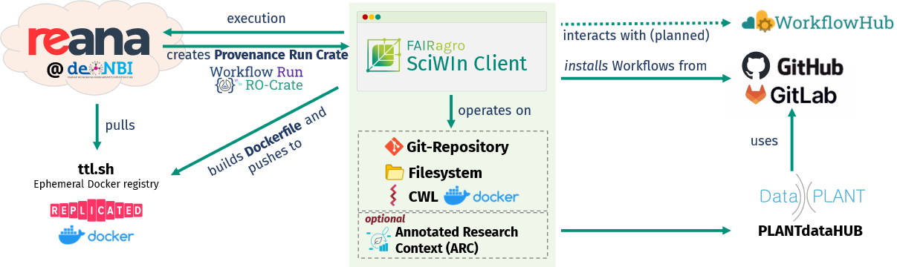
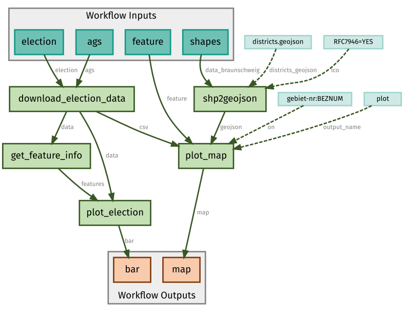

# Summary
SciWIn-Client is a command-line tool developed as part of FAIRagro's Scientific Workflow Infrastructure (SciWIn). It is designed to streamline the creation, execution and management of reproducible computational Workflows using the Common Workflow Language (CWL).
SciWIn-Client allows researchers to create and modify CWL CommandLineTools and workflows with minimal amount of work. It supports local and remote workflow execution within containerized environments enabling consistent results across different systems.
By integrating with Git it promotes transparent and collaborative workflow development helping researchers to share their work in a reproducible and substainable way.
...

# Statement of Need
Automated computational workflows have become essential across various scientific disciplines to manage complex, multi-step data analysis procedures.[ref?] Significant resources have been invested into domain specific languages that formalize and standardize computational scientific processes, thereby enhancing reproducibility, scalability and efficiency. In order to harmonize and standardize the proliferation of workflow languages, the Common Workflow Language (CWL)[@Crusoe2022MethodsIncluded] was created as a higher-level standard. However, CWL's verbose syntax, while enabling great flexibility, creates a steep learning curve that may hinder the language from reaching its full potential in the broader scientific community. On the other hand, CWL's foundation in the YAML file format ensures excellent machine readability and actionability, facilitating automated processing and integration. CWL is actually predestined to be written by machines rather than humans, which ultimately led to the conception of SciWIn-Client.

SciWIn-Client is a command-line application based on Rust that makes it simple to transform scripts and command-line tools into complex CWL Workflows...
... FAIRagro-Consortium[@Ewert2023Proposal]

# Features and Implementation

...

## Creation of CWL Files
To create CWL CommandLineTools, users must prefix their tool or script invocations with the `s4n create` prefix. The SciWIn client automatically identifies the inputs of the CommandLineTool based on the program call. Outputs are the newly generated files produced after executing a command or script. When a new project is initialized, a Git repository is created in the background to provide a version-controlled environment for tracking changes and support this process. While the system can automatically infer inputs and outputs, users also have the option to define them explicitly. Users can specify a container image pulled from Docker Hub or provide paths to local Dockerfiles to ensure consistent, reproducible execution environments across different systems.

## Workflow Execution
The simplest way to execute a workflow is to run it directly on the machine where the workflow is defined by using the `s4n execute local` command (or `cwltool` which however does not support Windows).
When performing high demanding calculations, workflows often need to be dispatched to large compute clusters. For the execution on compute clusters SciWIn-Client is able to communicate with the REST-API of Reana[@Simko2019Reana]. Reana is a reproducible research data analysis platform provided by CERN. FAIRagro operates their own Reana Installation in de.NBI Cloud. 
Structured execution results in form of RO-crates[@SoilandReyes2022ROCrate] more specifically Workflow Run RO-Crates[@Leo2024WRRC] using the Provenance Run Crate profile can be exported. ...
...

## Other Features?
Install, ...?

## Example Use case (?)

A proof of concept use case is provided (?). An overview graph can be seen in \autoref{fig:example}. 

## Future Plans
... GUI and stuff ...

# Acknowledgements 
We gratefully acknowledge the financial support of the German Research Foundation (DFG) – project number 501899475.

# References